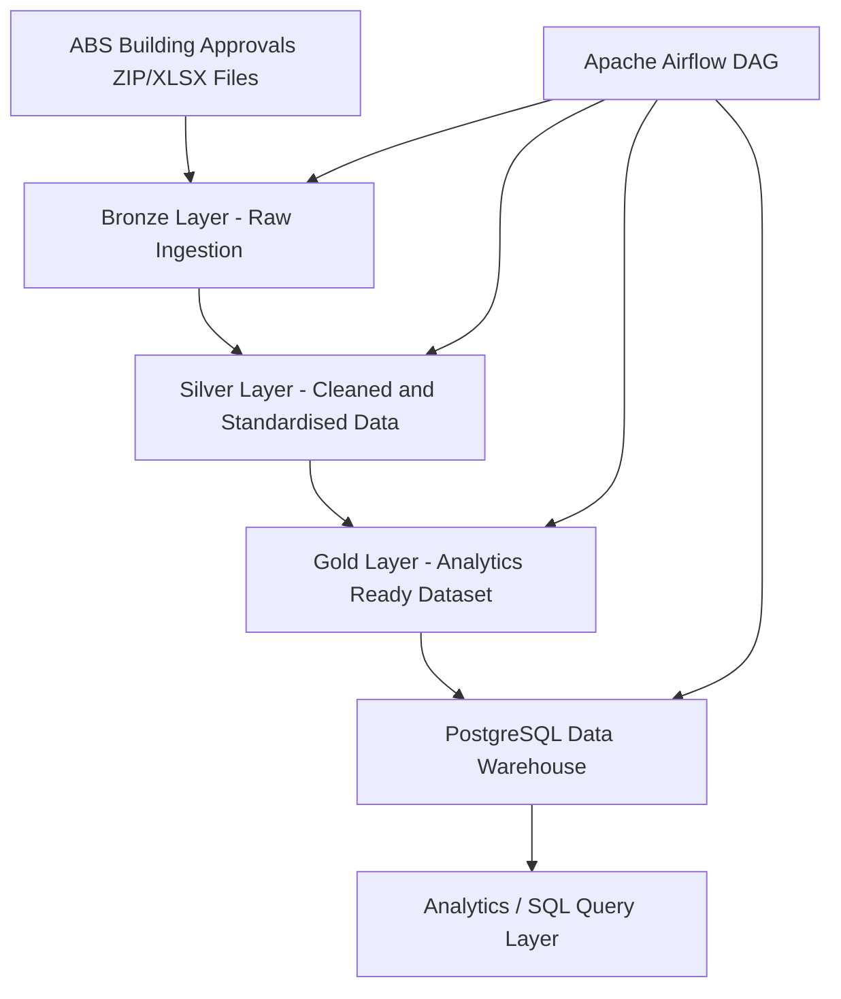
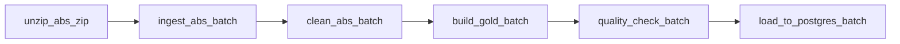

# Aussie Property Lakehouse Pipeline

This project implements an end-to-end batch data engineering pipeline for Australian Bureau of Statistics (ABS) building approvals data.

The pipeline ingests raw ABS Excel workbooks, processes them through Bronze, Silver, and Gold layers, applies basic data quality checks, and loads the final curated dataset into PostgreSQL. Workflow orchestration is handled with Apache Airflow and the environment runs in Docker.

The project was built to simulate a practical analytics engineering workflow using a layered data architecture and reproducible orchestration.

## Architecture



## Airflow DAG



## Pipeline Overview

The pipeline follows a simple layered design:

- **Bronze**: raw ABS files ingested with minimal modification
- **Silver**: cleaned and standardised intermediate datasets
- **Gold**: final analytics-ready dataset prepared for warehouse loading

The final warehouse table is:

```sql
building_approvals_gold_batch
```

## Tech Stack

- Python
- Pandas
- PostgreSQL
- Apache Airflow
- Docker
- SQLAlchemy
- openpyxl

## Data Source

Source data is based on Australian Bureau of Statistics building approvals datasets distributed as Excel workbooks.

## Project Structure

```text
aussie-property-lakehouse/
├── airflow/
├── dags/
├── data/
│   ├── raw/
│   ├── bronze/
│   ├── silver/
│   └── gold/
├── src/
│   ├── etl/
│   ├── ingestion/
│   ├── quality/
│   ├── pipeline/
│   └── transform/
├── tests/
├── docker-compose.yml
└── README.md
```

## How to Run

Start the PostgreSQL warehouse:

```bash
docker compose up -d
```

Start Airflow from the `airflow/` directory:

```bash
cd airflow
docker compose up -d
```

Open Airflow:

```text
http://localhost:8081
```

Trigger the DAG:

```text
abs_building_approvals_pipeline
```

## Example Validation

Check that the final warehouse table has loaded successfully:

```sql
SELECT COUNT(*) FROM building_approvals_gold_batch;
```

Expected result in the current project setup:

```text
474
```

## Notes

This project uses batch ingestion and a layered transformation approach to keep raw, cleaned, and curated datasets separate. The workflow is designed for reproducibility and local demonstration rather than production-scale deployment.

## Future Improvements

Possible next steps for extending the project:

- replace local storage with S3-compatible object storage
- add dbt for transformation modelling
- add Great Expectations for richer data validation
- implement dimensional warehouse modelling
- add BI dashboard integration
