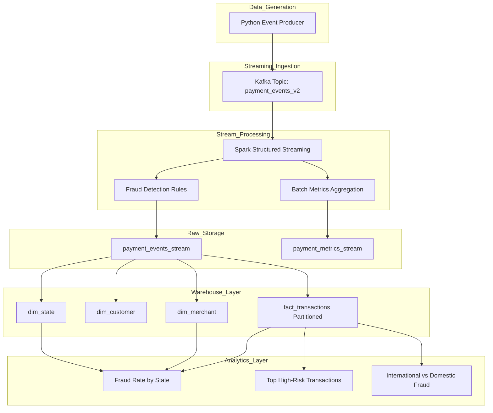

# Real-Time Fintech Fraud Pipeline Architecture (v2)

```mermaid
flowchart TD

    subgraph Data_Generation
        A[Python Event Producer]
    end

    subgraph Streaming_Ingestion
        B[Kafka Topic: payment_events_v2]
    end

    subgraph Stream_Processing
        C[Spark Structured Streaming]
        D[Fraud Detection Rules]
        E[Batch Metrics Aggregation]
    end

    subgraph Raw_Storage
        F[payment_events_stream]
        G[payment_metrics_stream]
    end

    subgraph Warehouse_Layer
        H[fact_transactions Partitioned]
        I[dim_customer]
        J[dim_merchant]
        K[dim_state]
    end

    subgraph Analytics_Layer
        L[Fraud Rate by State]
        M[Top High-Risk Transactions]
        N[International vs Domestic Fraud]
    end

    A --> B
    B --> C
    C --> D
    C --> E
    D --> F
    E --> G
    F --> H
    F --> I
    F --> J
    F --> K
    H --> L
    H --> M
    H --> N
    J --> L
    K --> L
```
